# 糖胡芦图：让价格告诉你发生了什么，让成交量告诉你真正重要的是什么。

# Tanghulu Chart: Price tells you what happened. Volume tells you what mattered.

# 糖胡芦图（Tanghulu Chart）

一种融合价格与成交量分布的新型金融图表。

A new financial chart that combines price action and volume distribution into a single visual representation.

---

## 项目简介 | Introduction

传统K线图已经使用了数百年。

它能够有效表达：

* 开盘价（Open）
* 最高价（High）
* 最低价（Low）
* 收盘价（Close）

但存在一个天然缺陷：

对于同样的OHLC数据，市场在不同价格位置发生了多少成交，传统K线无法表达。

例如，两根完全相同的K线：

* Open = 100
* High = 110
* Low = 95
* Close = 108

可能对应完全不同的市场结构：

情况A：

大部分成交发生在103~104附近。

情况B：

大部分成交发生在96~98附近。

传统K线看起来完全一样，但对于交易者而言，这两种情况的市场含义可能截然不同。

Traditional candlestick charts have been used for centuries.

They efficiently represent:

* Open
* High
* Low
* Close

However, they have a fundamental limitation:

They do not reveal where trading activity actually occurred within the price range.

For example, two candles may share exactly the same:

* Open = 100
* High = 110
* Low = 95
* Close = 108

Yet represent completely different market structures.

Scenario A:

Most trading volume occurred around 103–104.

Scenario B:

Most trading volume occurred around 96–98.

A traditional candlestick displays both scenarios identically, even though their market structures are fundamentally different.

---

## 设计理念 | Design Philosophy

糖胡芦图（Tanghulu Chart）的核心思想是：

不要只记录价格到过哪里，还要记录市场在哪些价格真正发生了成交。

因此，每个价格层不仅包含价格信息，还包含对应的成交量信息。

图形中的视觉权重由成交量决定：

* 成交量越大，该价格层越突出；
* 成交量越小，该价格层越弱化。

最终形成一种同时表达：

* 时间
* 价格
* OHLC
* 成交量
* 成交量分布

的新型金融图表。

The core idea of the Tanghulu Chart is simple:

A chart should show not only where price traveled, but also where trading activity actually occurred.

Each price level therefore carries both:

* Price information
* Volume information

The visual weight of the chart is influenced by volume distribution across price levels:

* Higher volume regions become more visually significant;
* Lower volume regions become less prominent.

The result is a chart capable of expressing:

* Time
* Price
* OHLC
* Volume
* Volume distribution

within a single visual object.

---

## 为什么叫“糖胡芦图” | Why “Tanghulu Chart”

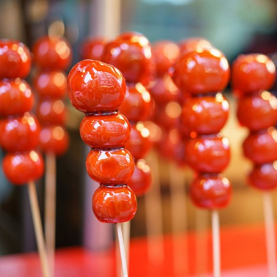

名称来源于中国传统小吃：

糖葫芦。

在很多市场中，成交量会集中在某个价格区域附近，形成中间较宽、上下较窄的轮廓。

视觉上类似：

* 糖葫芦
* 沙漏
* 山峰
* 火山

糖葫芦大多数情况下是红色的，而红色在中国股市中代表上涨，希望这个颜色带来美好的寓意。

“胡”字取自作者姓氏，因此命名为：

糖胡芦图（Tanghulu Chart）

The name originates from the traditional Chinese snack Tanghulu.

In many markets, trading activity clusters around certain price regions, producing shapes that resemble:

* Candied hawthorn sticks
* Hourglasses
* Mountains
* Volcanoes

Tanghulu are mostly red. In China's stock market, red represents an upward trend, and I hope this color brings auspicious implications.

The Chinese character “Hu” (胡) also references the creator's surname.

Therefore the chart is named:

Tanghulu Chart

---

## 与传统K线的区别 | Difference from Traditional Candlesticks

### 传统K线 | Traditional Candlestick

* 表达价格
* 表达涨跌
* 无法表达价格内部成交结构
* Shows price movement
* Shows bullish/bearish direction
* Does not reveal internal volume structure

### 糖胡芦图 | Tanghulu Chart

* 表达价格
* 表达涨跌
* 表达成交量
* 表达价格成交量分布
* 表达POC
* 表达Value Area
* Shows price movement
* Shows bullish/bearish direction
* Shows volume
* Shows volume distribution
* Shows POC
* Shows Value Area

单根图形承载更多市场信息。

Each chart element contains significantly more market information.

---

## 核心概念 | Key Concepts

### POC（Point Of Control）

成交量最大的价格。

通常代表市场最主要的成交成本区域。

The price level with the highest traded volume.

Often interpreted as the market's dominant transaction price.

---

### Value Area

价值区域。

通常定义为累计约70%成交量所在价格区间。

用于观察市场主要交易活动集中在哪些价格。

The primary trading region.

Typically defined as the price range containing approximately 70% of total volume.

It helps identify where most trading activity is concentrated.

---

## 项目目标 | Project Goal

本项目并不是为了替代所有金融图表。

而是探索一种新的可视化方式：

让价格与成交量分布能够在同一个图形中被同时观察。

目前仍处于实验阶段。

欢迎提出改进建议，或者在你的工具采用这个设计理念。

This project is not intended to replace all existing financial charts.

Instead, it explores a new visualization language that integrates price and volume distribution into a single graphical object.

The project is currently experimental.

Feel free to share suggestions for improvement, or adopt this design concept in your tools.

---

## AI制作的示例 | Examples created by AI

#### GLM5.2

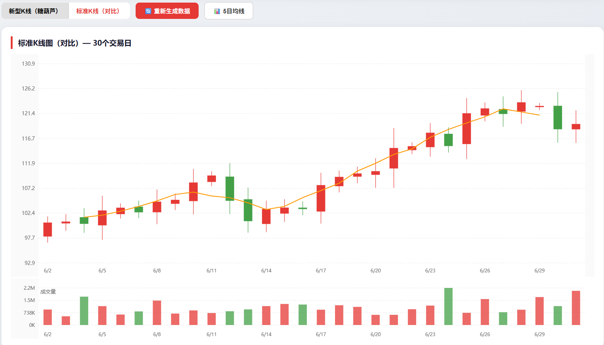

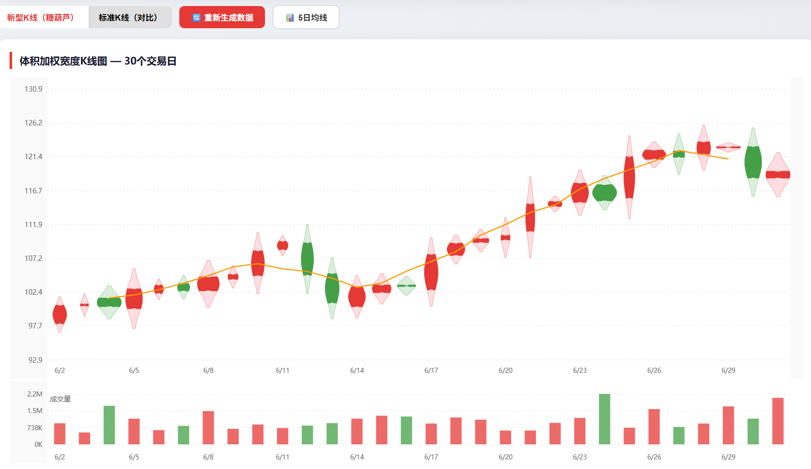

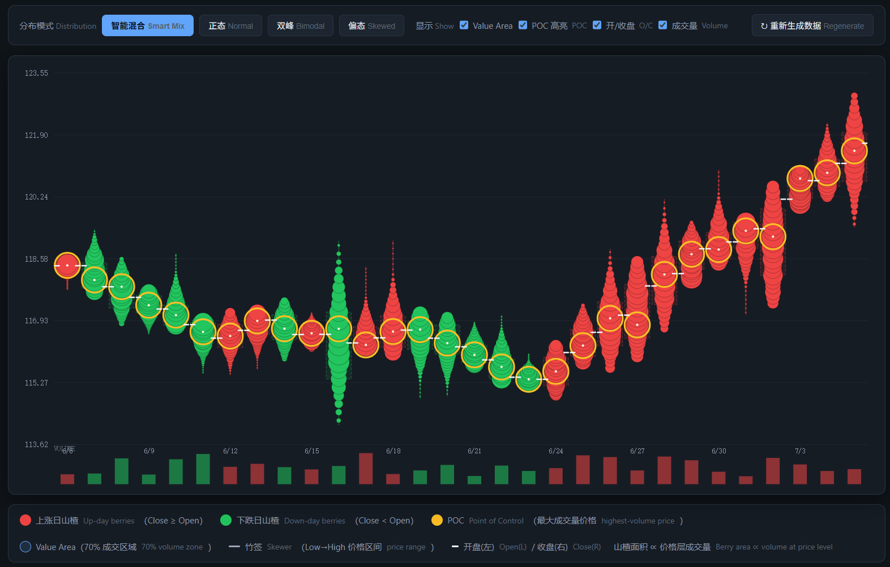

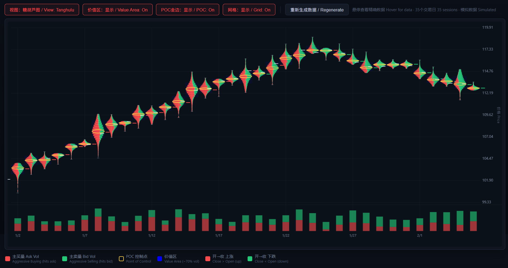

#### Claude

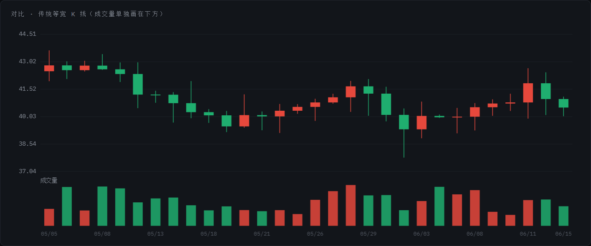

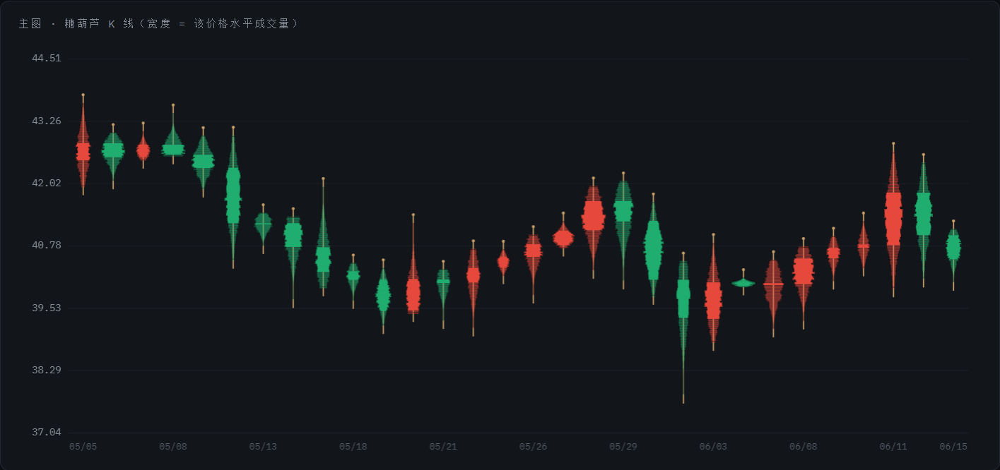

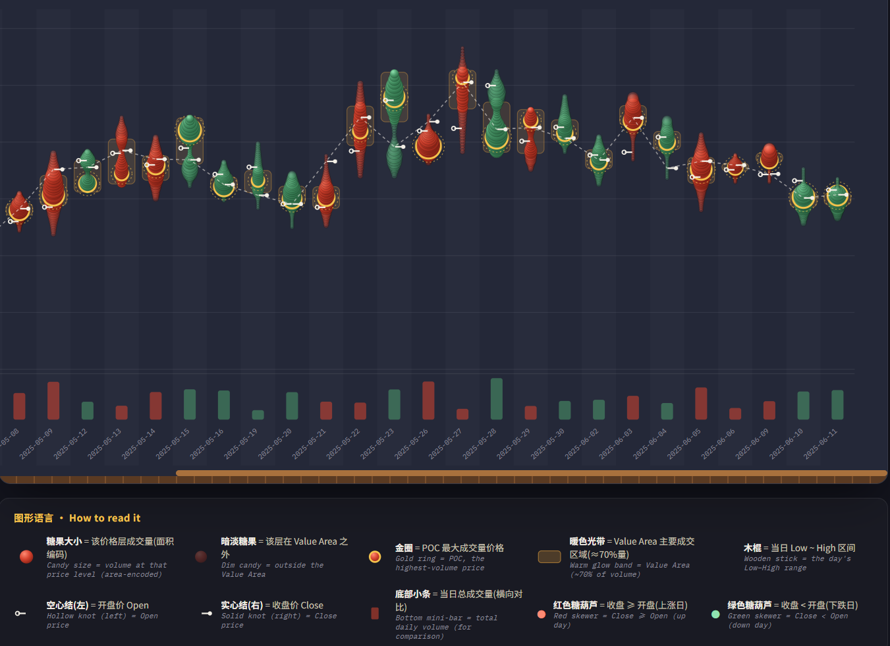

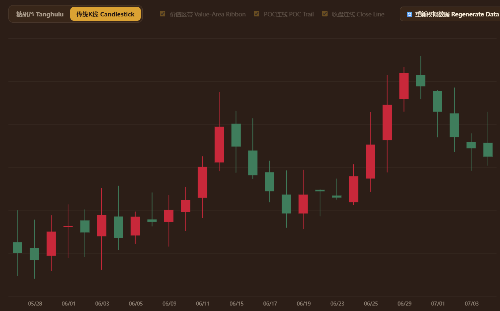

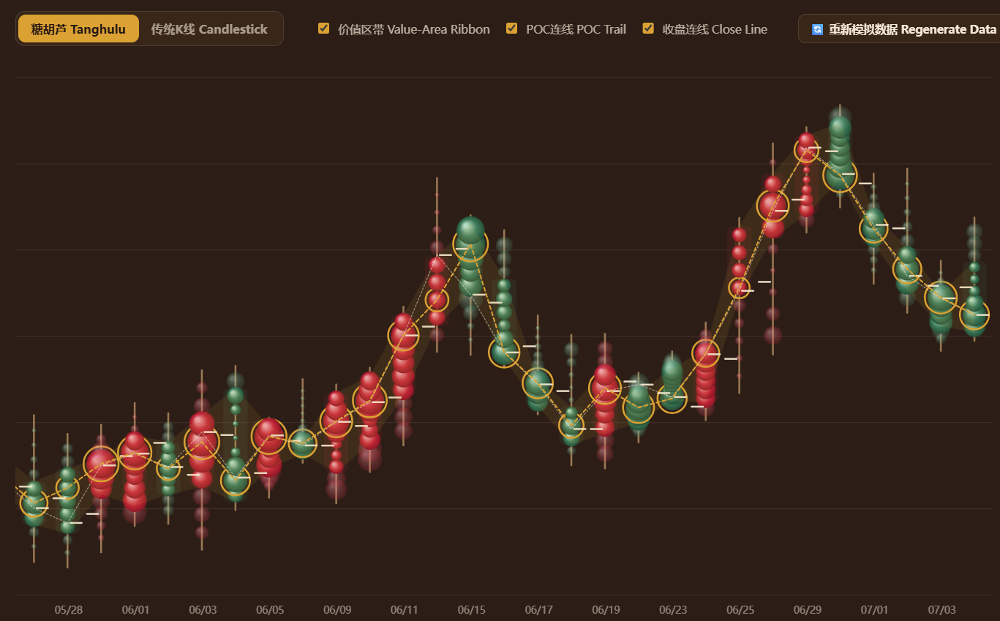

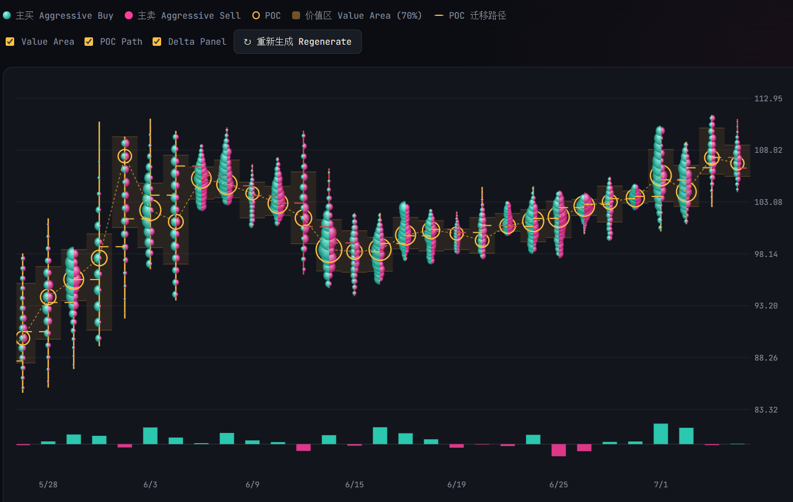

#### Gemini

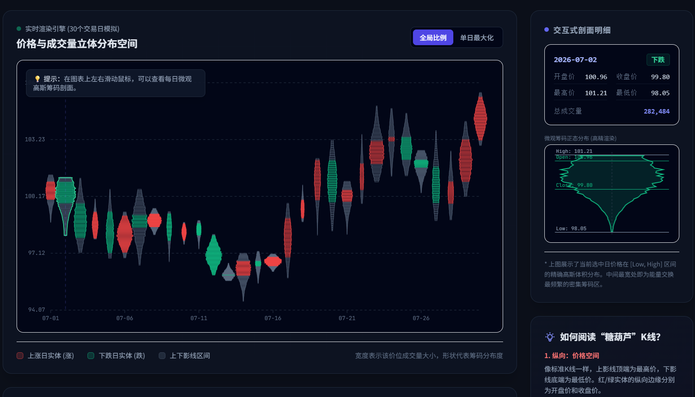

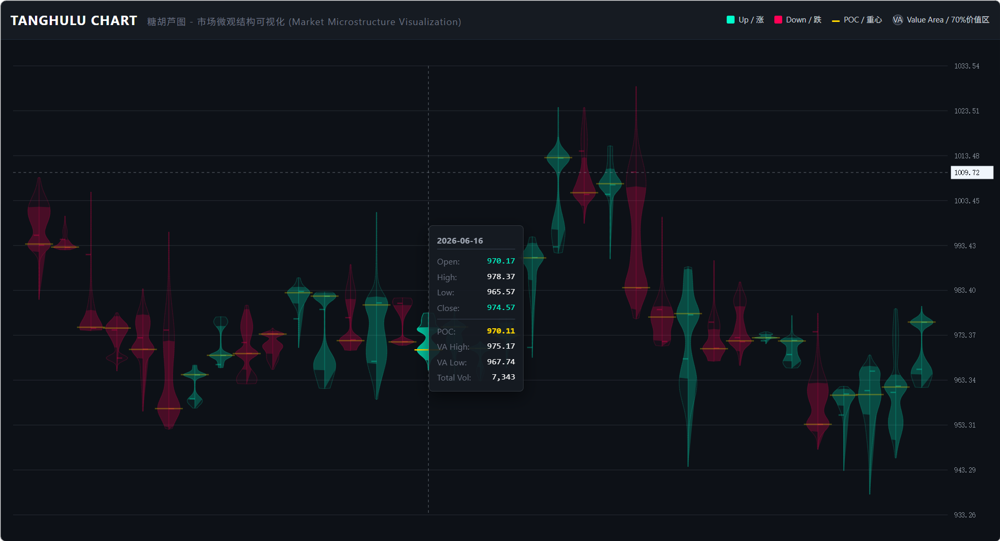

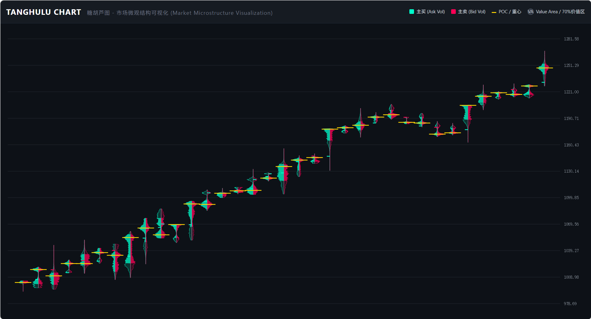

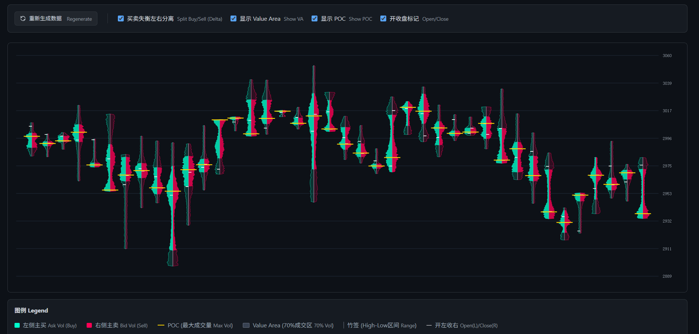

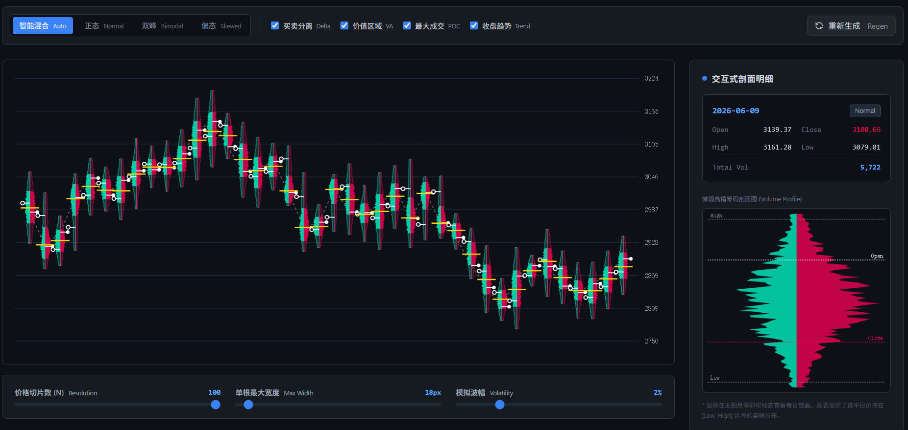

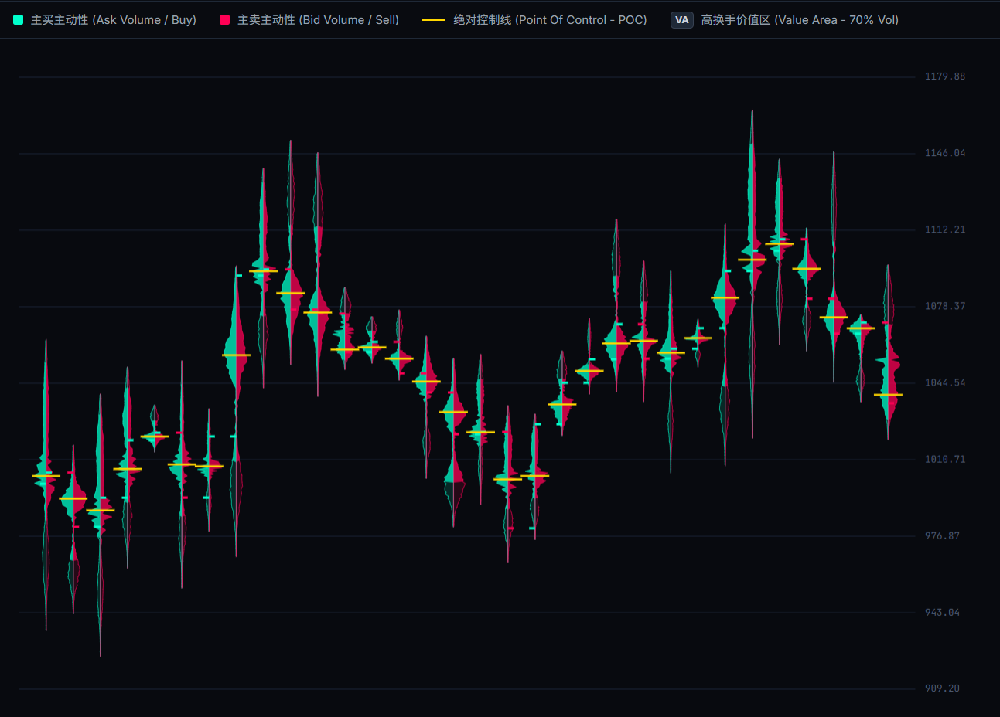

---

## 开源协议 | License

建议采用 MIT License。

Recommended license: MIT License.

---

## 免责声明 | Disclaimer

本项目仅用于金融数据可视化研究与技术交流。

不构成任何投资建议。

请勿据此进行实际交易决策。

This project is intended for financial data visualization research and educational purposes only.

It does not constitute investment advice.

Use at your own risk.
